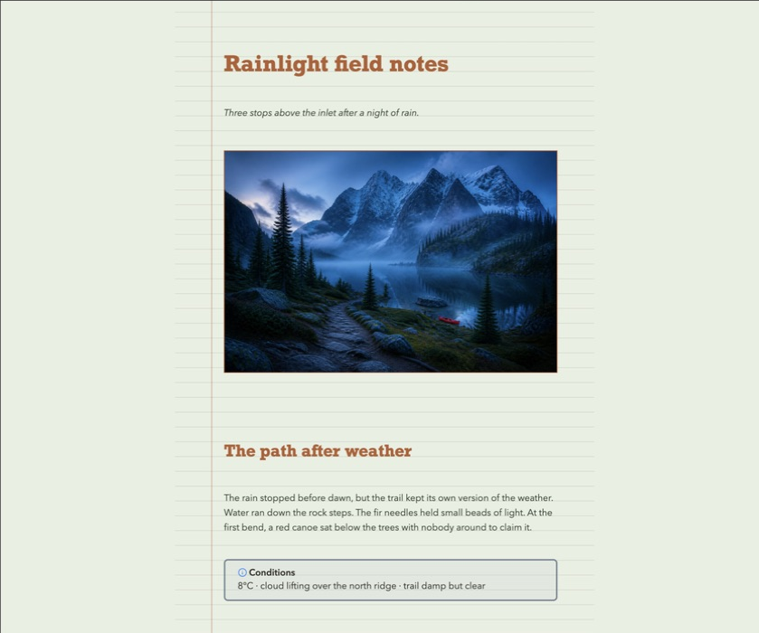
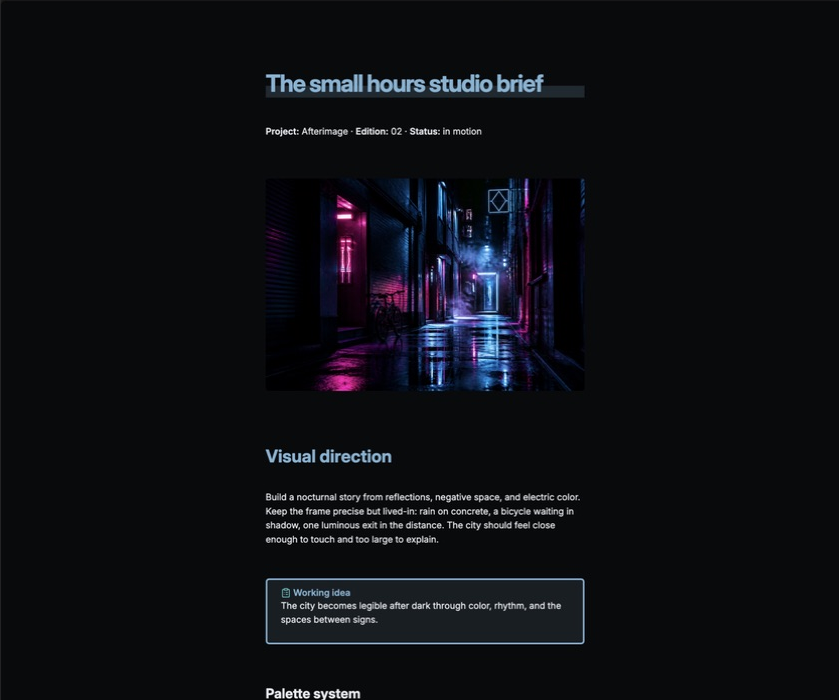
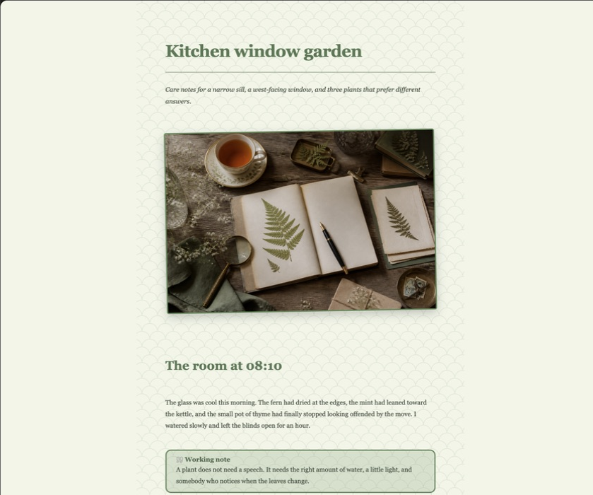

# Templar

> Give every Markdown note its own visual identity.

Templar gives Markdown notes their own page styles. Use a note as a journal, study sheet, project brief, travel log, or scrapbook. The note stays Markdown, and its design travels with it.

[](https://github.com/K0g1/Templar/releases)
[](LICENSE)
[](https://k0g1.github.io/Templar/)

> [!IMPORTANT]
> Templar is beta software. BRAT and manual release assets are supported prerelease installation paths. Back up important vaults before testing prerelease software; physical iOS and Android validation remains a beta reporting target.

## A few page styles

| Rainlight field notes | Small hours studio brief | Kitchen window garden |
| :---: | :---: | :---: |
| [](docs/assets/gallery/rainlight-field-notes.png) | [](docs/assets/gallery/small-hours-studio-brief.png) | [](docs/assets/gallery/kitchen-window-garden.png) |

The gallery images are cropped screenshots of the display notes rendered in Obsidian. Each crop keeps the styled note canvas and removes the sidebars, tab bar, status strip, scrollbar, and pointer. The notes are plain Markdown with no frontmatter at the top. Their source files and artwork are in [`examples/Templar Showcase/`](examples/Templar%20Showcase/). The [project website](https://k0g1.github.io/Templar/) renders the field-guide notes in `examples/Templar Field Guide/` with Templar's compiled stylesheets.

## Browse the style library

Templar includes **132 built-in styles** in themed folders. The library has search, Recent, Favorites, usage-aware sorting, and Compact, Comfortable, and Gallery layouts. Themes cover calm neutrals, seasonal palettes, academic papers, professional layouts, wellness journals, travel notebooks, vintage editorials, dark neon systems, fantasy pages, and more.

- Press `/` to search, use the arrow keys to move, Space to preview a style on the current note, and Enter to apply it.
- Click a card to preview a style without writing frontmatter. Apply is a separate action.
- Surface recent, favorite, frequently used, and current-folder styles without rescanning the vault on every open.
- Search by style name, folder, description, creator, or tag.
- Star favorites, keep custom styles in their own library, and export a selection or folder as a portable `.templar-pack`.

## Markdown and page controls

- Styles cover headings through H6, emphasis, highlights, links, lists, tasks, quotes, code, tables, callouts, Mermaid or rendered blocks, embeds, dividers, and images. Baseline-aware styles return following text to the next ruled row after variable-height content.
- Choose a natural reflowing note or a fixed A4, Letter, or custom page that scales as one sheet on narrow screens.
- Add paper patterns, baseline-aware typography, image treatments, watermarks, callout palettes, and table styling.
- Create a style with guided controls, edit its raw definition, or import and export portable `.templar` files.
- Prepare fonts, images, pagination, paper, patterns, watermarks, and page sizes before handing a styled note to Obsidian's print dialog.
- Use the same self-contained note design across Obsidian desktop and mobile.

## Beta installation via BRAT

1. Install **Obsidian42 - BRAT** from Community Plugins and enable it.
2. Run **BRAT: Add a beta plugin for testing** from the command palette.
3. Paste `K0g1/Templar` and add the plugin.
4. Enable **Templar** under **Settings → Community plugins → Installed plugins** if it is not enabled automatically.

[Add Templar to BRAT](obsidian://brat?plugin=K0g1/Templar)

For reproducible bug reports, run **BRAT: Add a beta plugin with frozen version based on a release tag**, enter `K0g1/Templar`, and use `1.2.0-beta.1`. Frozen installs do not follow later releases automatically. BRAT's current minimum Obsidian version is documented as 1.11.4; Templar itself supports Obsidian 1.8.0, so use manual installation on older supported Obsidian versions.

See the full [installation guide](docs/INSTALLATION.md) for updates, reinstalling, troubleshooting, and manual installation.

## Manual installation

1. Open the [Templar releases page](https://github.com/K0g1/Templar/releases).
2. Download `main.js`, `manifest.json`, and `styles.css` from the release you want to test.
3. Create `<your-vault>/.obsidian/plugins/templar/`.
4. Place all three downloaded files in that folder.
5. Reload Obsidian, then enable **Templar** under **Settings → Community plugins → Installed plugins**.

Templar is not yet listed in the Obsidian Community Plugins directory, so it will not appear in Browse or search results there.

## Your first styled note

1. Open a Markdown note.
2. Select the paintbrush ribbon icon or run **Open page styles** from the command palette.
3. Search or browse, then click a card or press Space to preview it on the note.
4. Select **Apply** or press Enter. Templar preserves existing page settings. A new note uses the default page-flow setting, so the common path does not open a page-mode dialog.
5. Use **Customize** for note-only adjustments, or a card's **Apply with page options…** action when you want a different page flow.

Previewing never writes the note. Applying a style does not rewrite the Markdown body, and removing Templar styling returns the note to its normal Obsidian appearance.

## Privacy and portability

Templar has no account, telemetry, ads, API key, or network traffic. It reads and writes through Obsidian's vault APIs, keeps each note's complete design in one frontmatter property, and treats imported styles, packs, custom CSS, and synced note frontmatter as untrusted. Imports are bounded and validated before use. Generated CSS is isolated to the exact Markdown leaf, including when the same note is open in two panes.

## Project links

- [Documentation](docs/README.md)
- [Developer reference and maintainer handoff](docs/DEVELOPER_REFERENCE.md)
- [Template specification](docs/TEMPLATE_SPEC.md)
- [Contributing](CONTRIBUTING.md)
- [Security policy](SECURITY.md)
- [Changelog](CHANGELOG.md)

<details>
<summary><strong>Build from source</strong></summary>

```bash
git clone https://github.com/K0g1/Templar.git
cd Templar
npm install
npm run check
```

Copy the generated `main.js`, `manifest.json`, and `styles.css` into `<your-vault>/.obsidian/plugins/templar/`, then reload Obsidian.

</details>

## License

MIT. See [`LICENSE`](LICENSE).
