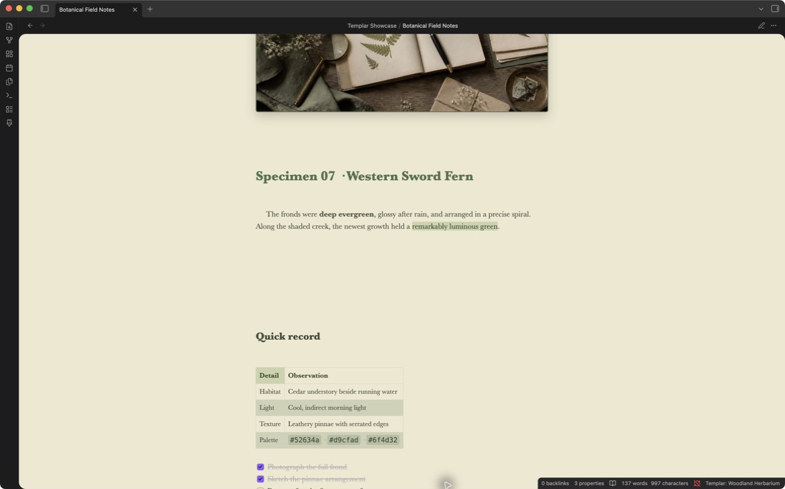
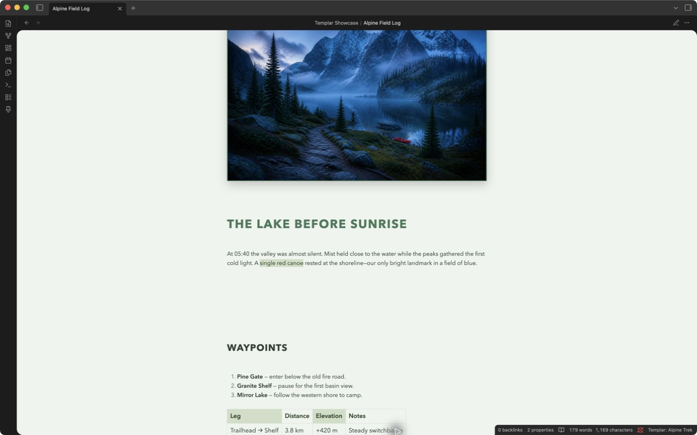
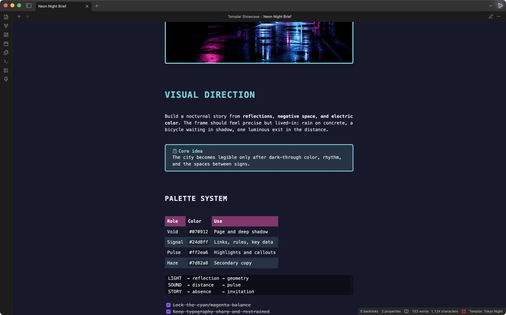

# Templar

> Give every Markdown note its own visual identity.

Templar turns ordinary Obsidian notes into polished journals, study sheets, project briefs, travel logs, scrapbooks, and more—without taking ownership of your writing. Your note stays Markdown. Its design travels with it.

[](https://github.com/K0g1/Templar/releases)
[](LICENSE)

> [!IMPORTANT]
> Templar is alpha software. BRAT is a supported alpha installation path under final clean-vault validation; this project does not call it recommended until the release E2E matrix is recorded. Manual installation remains available. Back up important vaults before testing prerelease software.

## See what your notes can become

| Botanical field notes | Alpine travel log | Neon creative brief |
| :---: | :---: | :---: |
| [](docs/assets/gallery/botanical-field-notes.png) | [](docs/assets/gallery/alpine-field-log.png) | [](docs/assets/gallery/neon-night-brief.png) |

These are real Markdown notes rendered by Templar inside Obsidian—not mockups. The example notes and original artwork are included in [`examples/`](examples/).

## A style library you can actually explore

Templar includes **132 built-in styles** organized into themed folders, with instant search, Recent, Favorites, usage-aware sorting, and Compact, Comfortable, or Gallery layouts. Browse calm neutrals, rich color stories, seasonal palettes, celebrations, academic papers, professional layouts, wellness journals, travel notebooks, vintage editorials, dark neon systems, fantasy pages, and more.

- Press `/` to search, use the arrow keys to move, Space to preview on the real note, and Enter to apply.
- Click a card to try a style without writing frontmatter; Apply is a separate, explicit action.
- Surface recently applied, favorite, frequently used, and current-folder styles without rescanning the vault on every open.
- Search by style name, folder, description, creator, or tag.
- Star favorites, keep custom styles in their own library, and export any selection or folder as a portable `.templar-pack`.

## Designed for real notes

- **Rich Markdown:** headings through H6, emphasis, highlights, links, lists, tasks, quotes, code, tables, callouts, Mermaid/rendered blocks, embeds, dividers, and images. Baseline-aware styles return following text to the next ruled row after variable-height content.
- **Two page modes:** use a natural reflowing note or a fixed A4, Letter, or custom page that scales as one sheet on narrow screens.
- **Visual depth:** paper patterns, baseline-aware typography, image treatments, watermarks, callout palettes, table styling, and more.
- **Your own designs:** create a style with guided controls, edit its raw definition, or import and export portable `.templar` files.
- **Safe evolution:** customize only the current note, review source-template updates with three-way merging, or automate unstyled notes with ordered folder/tag/name/property rules.
- **Print-ready output:** prepare fonts, images, pagination, paper, patterns, watermarks, and page sizes before handing the styled note to Obsidian's print dialog.
- **Desktop and mobile:** the same self-contained note design works across Obsidian desktop and mobile.

## Alpha installation via BRAT

1. Install **Obsidian42 - BRAT** from Community Plugins and enable it.
2. Run **BRAT: Add a beta plugin for testing** from the command palette.
3. Paste `K0g1/Templar` and add the plugin.
4. Enable **Templar** under **Settings → Community plugins → Installed plugins** if it is not enabled automatically.

[Add Templar to BRAT](obsidian://brat?plugin=K0g1/Templar)

For reproducible bug reports, run **BRAT: Add a beta plugin with frozen version based on a release tag**, enter `K0g1/Templar`, and use `1.2.0-alpha.2`. Frozen installs do not follow later releases automatically. BRAT's current minimum Obsidian version is documented as 1.11.4; Templar itself supports Obsidian 1.8.0, so use manual installation on older supported Obsidian versions.

See the full [installation guide](docs/INSTALLATION.md) for updates, reinstalling, troubleshooting, and manual installation.

## Manual installation

1. Open the [Templar releases page](https://github.com/K0g1/Templar/releases).
2. Download `main.js`, `manifest.json`, and `styles.css` from the release you want to test.
3. Create `<your-vault>/.obsidian/plugins/templar/`.
4. Place all three downloaded files in that folder.
5. Reload Obsidian, then enable **Templar** under **Settings → Community plugins → Installed plugins**.

Templar is not yet listed in the Obsidian Community Plugins directory, so it will not appear in Browse or search results there.

## Your first styled note

1. Open a Markdown note.
2. Select the paintbrush ribbon icon or run **Open page styles** from the command palette.
3. Search or browse, then click a card (or press Space) to preview it on the actual note.
4. Select **Apply** (or press Enter). Templar preserves an existing note's page settings; a new note uses the default page-flow setting, so no page-mode dialog interrupts the common path.
5. Use **Customize** for note-only adjustments, or a card's **Apply with page options…** action when you deliberately want a different page flow.

Previewing never writes the note. Applying a style never rewrites the Markdown body, and removing Templar styling returns the note to its normal Obsidian appearance.

## Private, portable, and yours

Templar has no account, telemetry, ads, API key, or network traffic. It reads and writes through Obsidian's vault APIs, keeps each note's complete design in one frontmatter property, and treats imported styles, packs, custom CSS, and synced note frontmatter as untrusted. Imports are bounded and validated before use; generated CSS is isolated to the exact Markdown leaf, including when the same note is open in two panes.

## Project links

- [Documentation](docs/README.md)
- [Developer reference and maintainer handoff](docs/DEVELOPER_REFERENCE.md)
- [Template specification](docs/TEMPLATE_SPEC.md)
- [Contributing](CONTRIBUTING.md)
- [Security policy](SECURITY.md)
- [Changelog](CHANGELOG.md)

<details>
<summary><strong>Build from source</strong></summary>

```bash
git clone https://github.com/K0g1/Templar.git
cd Templar
npm install
npm run check
```

Copy the generated `main.js`, `manifest.json`, and `styles.css` into `<your-vault>/.obsidian/plugins/templar/`, then reload Obsidian.

</details>

## License

MIT. See [`LICENSE`](LICENSE).
