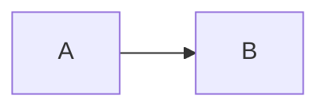

---
templar:
  version: 1
  template: classic-ruled
---


# Baseline torture fixture

agpqy lowercase descenders should cross the rule naturally.

## Heading level two

### Heading level three

#### Heading level four

##### Heading level five

###### Heading level six

Paragraph with **bold**, *italic*, ~~strike~~, `inline code`, a [[wikilink]], an [external link](https://example.com), ==highlighted text==, and a footnote reference[^one].

- [x] checked task
- [ ] unchecked task
  - nested bullet
    1. nested ordered item

1. ordered item
2. second ordered item

> A multi-line quotation with **formatting**.
>
> The second quote line should preserve the same grid.

---

***

___

| Column A | Column B | Column C |
| --- | :---: | ---: |
| One | Two | Three |
| A long cell with `code` | ==highlight== | 123 |

> [!warning] Callout title
> Callout body with a [link](https://example.com).
>
> - callout list item
> - another item

```js
const awkward = 'code block';

console.log(awkward);
```



Inline math $a^2+b^2=c^2$ and a display equation:

$$
\int_0^1 x^2\,dx = \frac{1}{3}
$$

![[Obsidian Elements Test Image.png]]


<div>
  Raw HTML that should remain inside the styled page.
</div>

<details>
<summary>Details disclosure</summary>

Expandable content with a blank line.
</details>

Another paragraph after variable-height blocks.

[^one]: Footnote content should not shift the fixed paper phase.
